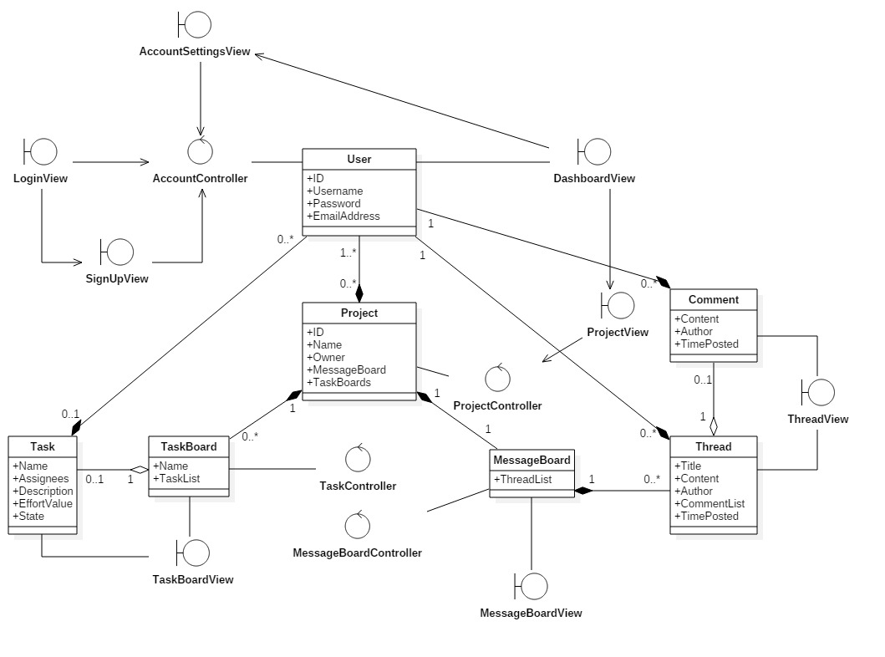

<!-- Link to jump to a section written in markdown-->
## PlanMe Analysis Document 
- Version 1.2, Last update: December 15, 2017

## Table of Contents
#### 1. [Indroduction](#introduction)

#### 2. [Purposes](#Purposes)

#### 3. [Object Classification](#Object)

* [3.1 Entity Objects](#Entity)
* [3.2 Boundary Objects](#Boundary)
* [3.3 Control Objects](#Control)

#### 4. [Diagrams](#specific)

* [4.1  Database Diagrams](#Diagrams1)
* [4.2 Boundary/Control/Entity Diagram](#Diagrams2)
* [4.3 State Diagram](#Diagrams3)
* [4.3.1 AccountManagerController](#3.3.1)
* [4.3.2 ProjectController](#3.3.2)
* [4.3.3 TaskController](#3.3.3)
* [4.3.4 MessageBoardController](#3.3.4)

# Authors
- Frank Khalil
- Chris Vanderhyden
- Randy Dang
- Braydon Kains
- Joel Kipfer
- Ryley Davenport
- Ariba Saqlain
- Kevin Liang

###  1. Introduction

The aim of this document is to analyze and refine the requirements to achieve
a detailed understanding of the essential working components of the PlanMe application.

###  2. Purposes

PlanMe currently is a website that gives users a remotely shared work environment. The website gives the ability to manage big projects more effectively through subdividing a project into smaller tasks.

###   3.Object Classification
#####   3.1 Entity Objects
- User
- Comment
- Project
- Task
- TaskBoard
- Thread

#####   3.2 Boundary Objects
-	CreateProjectView - Where a host designs and creates a new project.

-	ProjectListView - Where all projects that a user is a member of can be viewed and accessed by the user.

-  ProjectTaskViewer (Whiteboard) - Where all classifications of a task are viewed, this includes:
   - ToDo: All tasks that have not yet started and need to be completed
   - InProgress: Tasks that are currently being worked on
   - Done: Tasks that have been completed  

-	UserLoginView – Where a user logs in with their unique username and password to access projects they are involved in. 

-	UserProfileViewer – Where a user can view and edit their current profile. 

-	UserRoleViewer – Where a user can view what their role is in context of the current project. 

#####   3.3 Control Objects
-  AccountManagerController - Controls the various account options a user has such as create account, login, signout, edit preferences, change password.

-  ProjectController - Controls anything that has to do with a project such as creating a project, adding and or removing a user, and changing roles within a project.

-  TaskController (subset of Project controller) - Controls the options a user has for the tasks. This includes create task, move task, assign task, and edit task.

###   4.Diagrams

####   4.1 Data Model Diagram

####   4.2 Boundary/Control/Entity Diagram 

####   4.3 State Diagram

####   4.3.1 AccountManagerController
Outline of the possible options for a User account

1. CreateAccount
2. LoginAccount
3. SignOut
4. EditPreferences
5. ChangePassword

#####   4.3.2 ProjectController
Outline of the possible options for a Project entity

1. CreateProject
2. AddUser
3. ChangeRole

#####   4.3.3 TaskController(subset of ProjectController)
Outline of the possible options for a Task entity

1. CreateTask
2. MoveTask
3. AssignTask
4. EditTask

#####   4.3.4 MessageBoardController(subset of ProjectController)
Outline of the possible options for the Message Board
1. CreateThread

2. EditThread
3. DeleteThread
4. AddComment
5. EditComment
6. DeleteComment

