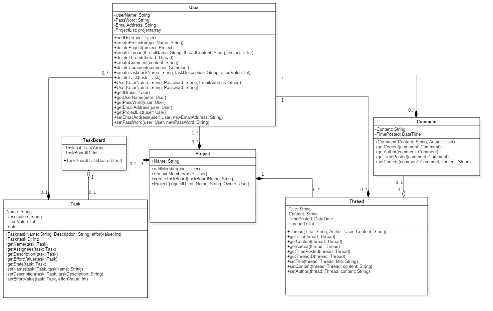

## PlanMe Design Document
- Version 1.2.1.0.2, Last update: December 14 2017

## Table of Contents

#### 1. [Introduction](#Introduction)

* [1.1 Purpose](#Purpose)
* [1.2 Product Scope](#ProductScope)
* [1.3 Referencing Documents](#ReferencingDocuments)

#### 2. [Design Diagram](#DesignDiagram)

#### 3. [System Overview](#SystemOverview)
* [3.1 Project](#Project)
* [3.1.1 Project Functions](#ProjectFunctions)
* [3.2 User](#User)
* [3.2.1 User Functions](#UserFunctions)
* [3.3 Task](#Task)
* [3.3.1 Task Functions](#TaskFunctions)
* [3.4 Comment](#Project)
* [3.4.1 Comment Functions](#CommentFunctions)
* [3.5 Thread](#Project)
* [3.5.1 Thread Functions](#ThreadFunctions)
* [3.6 TaskBoard](#TaskBoard)

# Authors
- Graham Dubreuil
- Matthew Fung
- Braydon Kains
- Ryley Davenport
- Randy Dang
- Chris Vanderhyden
- Nicholas Koehler
- Frank Khalil
- Kevin Liang

##   1.Introduction

####   1.1 Purpose

This document outlines the design of the PlanMe web application and includes the detailed functions and designs for the PlanMe application. This document is intended for the developers of the application.

####   1.2 Product Scope

PlanMe is a web application that acts as a tool to allow groups to organize themselves to efficiently delegate work to its members and reach project goals on time. This is achieved by following the [Kanban](https://leankit.com/learn/kanban/what-is-kanban/ "Brief description of Kanban") (Japanese for "billboard") methodology - an agile method of project management focusing on the visualization of workflows, balancing demand and a team's resources for maximum efficiency.

Users have individual accounts to distribute project tasks. Users are able to maneuver through different subsections of the project in order to see which tasks are yet to be done, what's already in progress and what's already completed. In summary, PlanMe serves as an online project management platform that focuses on synchronized workflows to complete shared tasks.

####   1.3 Referencing Documents

- IEEE. IEEE Std 1016-1998 IEEE Recommended Practice for Software Design Descriptions. IEEE Computer Society, 1998
- Software Requirements document for the PlanMe Project
- Analysis document for The PlanMe Project

##  2. Design Diagram

##   3. System Overview
The major system features include:

##  3.1 User
A person who uses or operates the PlanMe website.
There is a User object for every user.

####  3.1.1 User Functions
##### addUser(user: User)
- Adds a User to an existing project.
##### createProject(projectName: String)
- Initializes a new project with given name.
##### createThread(threadName: String, threadContent: String, projectID: Int)
- Creates a thread in the message board of an existing project.
##### createTask(taskName: String, taskDescription: String, effortValue: Int)
- Creates a task in the current task board.
- The task starts with a given name, description and effort value (priority).
##### createComment(content: String)
- Creates a comment in the current thread given the text input.
##### deleteProject(project: Project)
- Deletes a project a user controls given the project object which contains the name of the project.
##### deleteThread(thread: Thread)
- Deletes a thread given the threadname. Permissions are given to creator and host.
##### deleteComment(comment: Comment)
- Deletes a comment in the current thread given the comment.
- Permissions are given to threadowner, host and creator.
##### deleteTask(task: Task)
- Deletes a task given the task.
##### User(Username: String, Password: String, EmailAddress: String)
- Creates a User entity.
- This entity is given a name, password, and email address.
##### User(Username: String, Password: String)
- Creates a User entity given a specific name and password.
##### getID(user: User)
- Returns the ID of the User given.
##### getUserName(user: User)
- Returns the name of the User given.
##### getPassword(user: User)
- Returns the password of the User given.
##### getEmailAddress(user: User)
- Returns the email of the User given.
##### getProjectList(user: User)
- Returns all projects a User is currently associated with the given user.
##### setEmailAdress(user: User, newEmailAddress: String)
- Changes the current email address of the given User with the new address given.
##### setPassword(user: User, newPassword: String)
- Changes the password of the User given new password.
##  3.2 Project
A project that a collection of users can collaborate on. The user who creates a Project is the Host.

####  3.2.1 Project Functions
##### addMember(user:User)
- Search for users using the user ID.
- Determine if user already exists in the project.
- If the user does not exist in the project, add the user to the project.

##### removeMember(user: User)
- Determine if a user already exists in the project.
- Removes a user from the project.

##### createTaskBoard(taskBoardName: String)
- Creates a task board given the task board name
- Determine if there is already a task board created by the user under the same name.
- If there does not already exist a task board under that name, create the task board.

##### Project(ProjectID: Int, Name: String, Owner: User)
- Assign the project a distinct numeric ID.
- Determine whether or not there is already a project with the same name.
- If there does not already exist a project under the same name, create the project.
- Designate the user who created the project as the owner of the project.

##  3.3 Task
A task assigned to a user of a PlanMe project

####  3.3.1 Task Functions
##### Task(taskName: String, taskDescription: String, effortValue: Int)
- Creates a task entity
- The task has a name, description and effortValue, which is an integer representing how difficult the task is
##### Task(taskID: Int)
- Creates a task based on an id that references a database
##### getName(task: Task)
- Returns the name of the given task
##### getAssignees(task: Task)
- Returns the list of users that have been assigned the given task
##### getDescription(task: Task)
- Returns the description of the given task
##### getEffortValue(task: Task)
- Returns the effort value of the given task
##### getState(task: Task)
- Returns the State of the given task
##### setName(task: Task, taskName: Sting)
- Changes the name of the given task to be the given taskName
##### setDescription(task: Task, taskDescription: String)
- Changes the description of the given task to be the given taskDescription
##### setEffortValue(task: Task, effortValue: Int)
- Changes the effortValue of the given task to be the given effortValue

##  3.4 Comment
A remark expressing an opinion or reaction in the form of a string.
####  3.4.1 Comment Functions
##### Comment(Content: String, Author: User)
- Determines which user is creating the comment.
- Creates a comment in the form of a string.

##### getContent(comment: Comment)
- Determines whether or not the comment being searched exists.
- Retrieves the comment and returns the comment, else null is returned.

##### getAuthor(comment: Comment)
-  Determines the author of the comment and returns the author of the comment.

##### getTimePosted(comment: Comment)
- Determines when a comment was posted, retrieves and returns the time when the comment was posted.

##### setContent(comment: Comment, content: String)
- Change the contents of the comment to the contents provided in the form of a string.

##  3.5 Thread
A thread is an entity part of message board where users can communicate to each other through the use of comments 

####  3.5.1 Thread Functions

##### Thread(title: String, author: User, content: String)
- Creates a thread entity 
- Thread is created with a title, the author that created the thread as well as contents the thread will hold
##### getTitle(thread: Thread)
- Returns the title of the given thread 
##### getContent(thread: Thread)
- Returns contents found in given thread
##### getAuthor(thread: Thread)
- Returns the author that created the given thread
##### getTimePosted(thread: Thread)
- Returns the time at which the given thread was created
##### getThreadID(thread: Thread)
- Returns given threads ID 
##### setTitle(thread: Thread, title: String)
- Change title of given thread to the new title provided  
##### setContent(thread: Thread, content: String)
- Change contents of given thread to the contents provided 
##### setAuthor(thread: Thread, content: String)
- Changes the author of the given thread to the new author provided 
## 3.6 TaskBoard 
 Provides an area to organize all of the tasks that are created in the current project
##### Taskboard(taskboardID: int)
- Creates a taskboard entity 
- Taskboard is created with a unique ID of type integer
- Each taskboard will be differentiated by their ID

