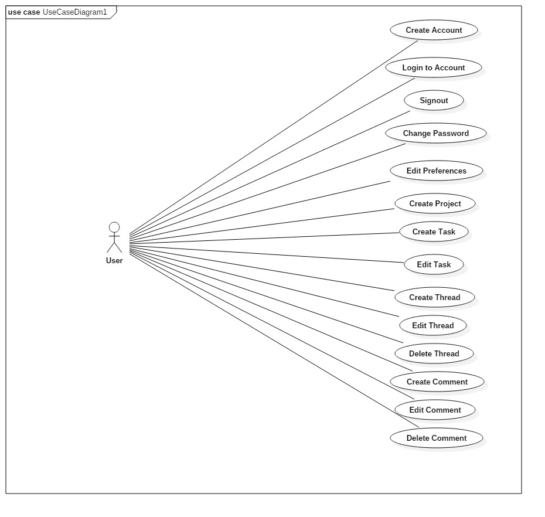

<!-- Link to jump to a section written in markdown-->
## PlanMe Requirements Document
- Version 1.3, Last update: December 15, 2017

## Table of Contents
#### 1. [Indroduction](#introduction)
* [1.1 Purpose](#purpose)
* [1.2 scope](#scope)
* [1.3 References](#references)
* [1.4 Overview](#overview)

#### 2. [Overall Description](#overall)

* [2.1 Product persepective](#perspective)
* [2.2 Use-Case Diagram](#usecase)
* [2.3 Product functions](#functions)
* [2.4 User characteristics](#characteristics)
* [2.5 Constraints](#constraints)
* [2.6 Assumptions and dependencies](#assumptions)
#### 3. [Specific Requirements](#specific)

* [3.1 External Interface Requirements](#external)

#### 4. [definitions](#glossary)

# Authors
- Randy Dang
- Ryley Davenport
- Graham Dubreuil
- Matthew Fung
- Nicholas Koehler
- Frank Khalil 
- Kevin Liang
- Taelor McMillan
- Chris Vanderhyden
- Joel Kipfer

##  1. Introduction
PlanMe is a web application that organizes group projects. The application allows users to create projects, invite members, and manage tasks. Other platforms enable members to communicate but this web app keeps members focused. This is done by showing users active tasks and member participation. A quantifiable way to track work and progress is sometimes needed when working in a group. On the other hand, threads and messages allow members to communicate about goals and issues. All together PlanMe enables users to be their best and most efficient while working together.

#####  1.1 Purpose
This document describes how the PlanMe web application functions. By defining different components of the web app the intention is to give the reader a more comprehensive view of the product.

#####   1.2 Scope
PlanMe allows multiple people to connect together in order to create and organize group projects.

This web application follows the [Kanban](https://leankit.com/learn/kanban/what-is-kanban/ "Brief description of Kanban") (Japanese for "billboard") methodology - an agile method of project management focusing on the visualization of work flows, balancing demand and a team's resources for maximum efficiency.

To better understand the kanban system, visualize a whiteboard divided into three columns: "To-do", "In Progress" and "Complete". Each piece of work required is a "task" in which users are assigned to work on them depending on their capacity. A task is any specific goal that the group deems necessary to track and complete.  All tasks start in the "To-do" column - serving as a list of tasks not yet started. Once a user is assigned a task, it moves to the "In Progress" column and once finished, the task lands into the "Complete" column.
By listing out every task needed to complete the project, team members can physically see the project's progress and synchronize their work accordingly.

Users have individual accounts for tasks to be distributed to them. Users are able to maneuver through different subsections of the project in order to see which tasks are in the to-do, what's already in progress and what's already completed. In summary, PlanMe serves as an online project management platform that focuses on synchronized workflows to complete shared tasks.

#####  1.3 References
IEEE Computer Society,(1998). IEEE Standard for Software Project Management Plans
#####  1.4 Overview
The rest of this document gives further detail on various requirements needed for PlanMe to run and all the unique functions that users of PlanMe have access to. Many different subsections provide different diagrams and illustrations in order to visually demonstrate how PlanMe runs.

##   2. Overall Description
#####   2.1 Product perspective
The PlanMe development team is broken into two groups, a front and back end.

**Front end:**

PlanMe is supported on any device that is capable of rendering HTML5 and JavaScript.

The front end of PlanMe is where the user interface is created. The user is initially taken to a page where they can log  in to their existing account or create a new account. After logging in the user is taken to the whiteboard where they have an overview of the projects they are involved in. The user can select any individual project to view their current tasks (Section 2.2 explains the whiteboard in more detail). The dashboard enables the user to switch between projects, and filter between the tasks that are shown on the whiteboard.

**Back End:**
  The back end team creates the HTML, CSS, and JavaScript code requested by the frontend. This team also manages a database to store user information, projects, project due dates, tasks, and messages.

#####   2.2 Use-Case Diagram

#####   2.3 Product functions

##### Create New Project
A single user chooses to create a new project and has the ability to invite different users to view and edit the project.
##### To-do, In Progress and Completed
- There are three different subsections of the main work bench in which users can examine and add documents as well as descriptions to:
	- To-do: This subsection holds all work that currently has to be completed. Descriptions such as deadlines and tasks can be added. Individual users are bounds to different deadlines and tasks.
	- In Progress: This subsection holds all work that is currently being worked on. Knowing if a task is in progress allows other users to be aware, preventing work collisions. This eliminates any confusion as to what has been done and what is already being worked on. Any edits or revisions of completed work can be moved from the done section to this section.
	- Completed: This subsection holds all work that has been completed. Files and descriptions in this subsection can still be edited if needed.

#####  Report Progress:
Users are able to confirm that they have completed or partially completed a task. If required by the project manager, the user is able to submit work that must be approved by the manager in order to have the task recognized as complete.

#####  Role Designation:
Project managers are able to assign certain roles to individuals, granting them different permissions. These permissions include allowing only certain members to access private files and the ability to delegate tasks between members.

##### Create Comment
Users can create comments on a created thread to express opinions or reactions. A thread must have been created beforehand in order to submit comments

##### Create Thread
Users can create threads in order to communicate with other project members. Multiple threads can be created in order to pertain to different situations and topics. Comments are used in order to communicate with other members and will only be visible in the corresponding thread.  
##### Join Existing Project
Users can join different projects with permission from the project host. Each project has a unique name or ID. The project ID allows users to find projects via an in-browser project search.
##### Add/Delete:
Users are able to add new tasks to the main work bench or delete tasks that are not required. This keeps the work bench organized and easy to read by other users. An effort value is given to every task created and can be updated in order to give other users notice of which tasks should be dealt with first and which ones can be saved for later.
##### Task descriptor
This function creates colour descriptor to allow users to visually group tasks together of the same colour. This will ease the differentiation of other tasks. 
##### Productivity Tracker
The main workbench will contain data that will keep track of the teams productivity, along with other information such as the amount of completed tasks and the amount of effort completed within the whole project.

#####   2.4 User characteristics
PlanMe is very easy to use for any user with a base web understanding. Once an account is made by the user, they have access to all functions of the web app.

#####   2.5 Constraints
Development and Implementation of PlanMe finishes before the end of December, 2017. Each user must have their own separate account in order to be found by other users. Development tools required for PlanMe are limited to whatever the development team has at hand as there is no budget for this project.

#####   2.6 Assumptions and dependencies
Users are assumed to have a device that supports web browsing in order to access PlanMe and a stable internet connection throughout the use of PlanMe. A solid connection is required from the users because the site is constantly updating itself with changes from group members.

##   3.Specific requirements

#####   3.1 External Interface Requirements
No external interface is required as all functions are built into the development of the web app.

##### User Interfaces:
- Users are presented with a sign up page that allows them to create an account needed for creating and joining projects.
- Users have access to all functions once an account is made.
- The main work bench shows all tasks laid out in three subsections; To-Do, In-Progress and Completed.
- Threads can be created by users to communicate with other users. Comments are then created in the threads to act as messages being sent to other users.
- Other drop down menus part of the main work bench show additional information such as your profile, current projects, tasks at hand, and users enlisted in current projects.

##### Software Interfaces:
- PlanMe operates on any standard internet browser (Internet Explorer, Google Chrome, and Mozilla Firefox)
- PlanMe requires a database to hold records.

##### Communication Interfaces:
- A thread object can be created to act as a message board to communicate with other users. Comments are created within the threads to act as messages. 
- Users are sent personal emails by the program itself or even by other members for situations such as upcoming due dates, notifications from new tasks, and reminders for current tasks.

##  4. Definitions
| Term                          | definition       |
| -------------                 | ------------- |
| PlanMe                        |PlanMe is a web application that organizes group projects. The application allows users to create projects, invite members, and manage tasks. Other platforms enable members to communicate but this web app keeps members focused. This is done by showing users active tasks and member participation. A quantifiable way to track work and progress is sometimes needed when working in a group.On the other hand, threads and messages allow members to communicate about goals and issues.All together PlanMe enables users to be their best and most efficent while working together.                 |
| Completed                     | Tasks that are done and no longer need to be worked on  |
| Git Merge                     |Join two or more development histories together|
|  Git Pull                     |Fetch from and integrate with another repository or a local branch|
| In-Progress                   | Tasks that are currently being worked on by indicated user(s). |
| Kanban                        | Japanese for "billboard") methodology - an agile method of project management focusing on the visalization of workflows, balancing demand and a team's resources for maximum efficiency. |
| Task                          | A trackable and achievable user defined goal. Each task has an effort level, descriptor and status,There may be multiple tasks inside every taskboard  There may be multiple tasks inside every taskboard. |
| Task descriptor               | a colour descriptor to allow users to visually group tasks together of the same colour. |
| Task status                   | visually seen by a task's location within the Kan-Ban style TaskBoard. The status may be To-Do , In-Progress or Done. |
| Task effort level             | A number descriptor for every task. May be from 1-5. the intent of effort level is to encourage members to work on tasks of a higher effort level or to describe their complexity.|
| Taskboard                     | The area in which the user can view each of their to-do, in-progress and done tasks. There may be multiple task boards for every project. |
| To-Do                         | Tasks that are yet to be completed and must be done by certain due dates if required. |
| Thread                        | A thread in the Message Board. Members of a project may create, edit or delete threads inside the Message Board. |
| Workbench                     | A drop-down part of PlanMe's interface that holds information such as your profile, current projects, tasks at hand, and users enlisted in current projects. The Workbench is also the gateway to the message board. |
|UML (Unified Modeling Language)| A standardized modeling language that will allow users to visually examine different aspects of the software.|

<!-- Note: keep in alphabetical order 
Completed - Tasks that are done and no longer need to be worked on 
Host - The creator of the project. Hosts will have the power to invite other users to be apart of the project as well as the the power to designate certain roles to the other users
In-Progress - Tasks that are currently being worked on by indicated user(s).
**[Kanban](https://leankit.com/learn/kanban/what-is-kanban/ "Brief description of Kanban") -** Japanese for "billboard") methodology - an agile method of project management focusing on the visalization of workflows, balancing demand and a team's resources for maximum efficiency.
Task - A trackable and achievable user defined goal. Each task has an effort level, descriptor and status. There may be multiple tasks inside every taskboard.
Task descriptor - a colour descriptor to allow users to visually group tasks together of the same colour.
Task status - visually seen by a task's location within the Kan-Ban style TaskBoard. The status may be To-Do , In-Progress or Done.
Task effort level - A number descriptor for every task. May be from 1-5. the intent of effort level is to encourage members to work on tasks of a higher effort level or to describe their complexity.
Taskboard - The area in which the user can view each of their to-do, in-progress and done tasks. There may be multiple task boards for every project.
To-Do - Tasks that are yet to be completed and must be done by certain due dates if required.\
Thread - A thread in the Message Board. Members of a project may create, edit or delete threads inside the Message Board.
UML (Unified Modeling Language) - A standardized modeling language that will allow users to visually examine different aspects of the software.Workbench - A drop-down part of PlanMe's interface that holds information such as your profile, current projects, tasks at hand, and users enlisted in current projects. The Workbench is also the gateway to the message board.
-->
